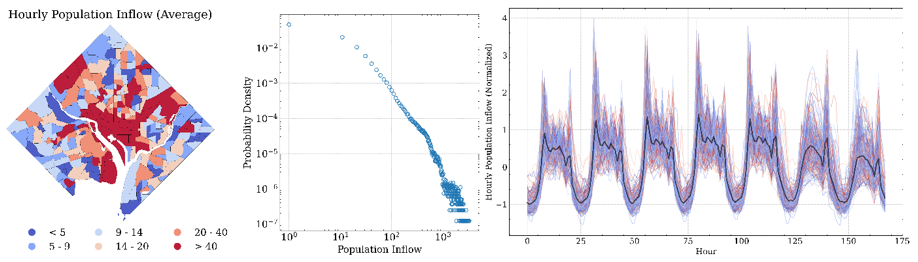

# Multi-ATGCN: A multi-graph multi-head adaptive temporal graph convolutional network for multivariable crowd inflow forecasting


This is a original PyTorch implementation of Multi-ATGCN in the following working paper: \
**Songhua Hu, Yiqun Xie, Chenfeng Xiong, Paul Schonfled, 2022, Multi-ATGCN: A multi-graph multi-head adaptive temporal graph convolutional network for multivariable crowd inflow forecasting**

## Environment
We use the torch == 1.10.2 and Python 3.6.11 for implementation.

We follow the framework of [LibCity](https://github.com/LibCity/Bigscity-LibCity) to prepare data and run the model.
See more details in the `requirement.txt` and the [LibCity document](https://bigscity-libcity-docs.readthedocs.io/en/latest/index.html).

Please execute the following command to get the source code.

```bash
git clone https://github.com/SonghuaHu-UMD/MultiSTGraph
cd MultiSTGraph
```

## Data Preparation
The group-based normalized crowd flow data files for Washington, D.C. and Baltimore City, i.e., `201901010601_DC_SG_CTractFIPS_Hourly_Single_GP.7z` and 
`201901010601_BM_SG_CTractFIPS_Hourly_Single_GP.7z`, are available at the `raw_data/` folder. Please extract them to the current fold and 
you will get a set of atomic files following the [LibCity](https://github.com/LibCity/Bigscity-LibCity) Unified Data Structures:

| filename    | content                                                                         | example                                              |
|-------------|---------------------------------------------------------------------------------|------------------------------------------------------|
| xxx.geo     | Store geographic entity attribute information.                                  | geo_id, type, coordinates                            |
| xxx.rel     | Store the relationship information between entities, i.e. the adjacency matrix. | rel_id, type, origin_id, destination_id, link_weight |
| xxx.dyna    | Store hourly crowd flow information.                                            | dyna_id, type, time, entity_id, Visits               |
| xxx.ext     | Store external time-varying information, such as weather, holidays, etc.        | ext_id, time, properties[...]                        |
| xxx.static  | Store external static information, such as socioeconomics, POIs, demographics.  | geo_id, properties[...]                              |
| xxx.gbst    | Store mean and std for each geo unit before the group-based z-score.            | geo_id, mean, std                                    |
| config.json | Used to supplement the description of the above table information.              |                                                      |

Data are retrieved from [SafeGraph](https://www.safegraph.com/) using the Weekly Places Patterns Dataset. 
If you want to extract dataset in other areas from the raw dataset. Run codes at  `./data_prepare`.
The data statistics of two datasets are as followed:

|                           | Washington, D.C.                              | Baltimore City (and surrounding counties) |
|---------------------------|-----------------------------------------------|-------------------------------------------|
| Date Range                | 01/01/2019 - 05/31/2019                       | 01/01/2019 - 05/31/2019                   |
| # Nodes                   | 237                                           | 403                                       |
| # Samples                 | 858,888                                       | 1,460,472                                 |
| Sample Rate               | 1 hour                                        | 1 hour                                    |
| Input length              | 24 hours                                      | 24 hours                                  |
| Output length             | 3 hours, 6 hours, 12 hours, 24 hours          | 3 hours, 6 hours, 12 hours, 24 hours      |                                    |
| Mean of crowd flow        | 30.169                                        | 14.41                                     |
| St.d. of crowd flow       | 84.023                                        | 29.3                                      |



## Code Structure
For easy comparison among different models, the code and data formats follow the framework proposed by [LibCity](https://github.com/LibCity/Bigscity-LibCity):
* The code for Multi-ATGCN is located at `./libcity/model/traffic_flow_prediction/MultiATGCN.py`.
* The code for dataset preprocessing is located at `./libcity/data/dataset/dataset_subclass/mth_dataset.py`.
* The configuration for the model is located at `./libcity/config/model/traffic_state_pred/MultiATGCN.json`.
* The user-defined configuration with the highest priority is located at `./config_user.json`.
[//]: # (* The code for other baselines is located at `./libcity/model/`.)

:exclamation: You can also directly copy the data and our model to the LibCity environment and run. 
However, I suggest using the repository here since some changes are made compared with the original LibCity:
* A new data format for static variables is added.
* A new dataset class, the mth_dataset, is added, to support multi-head temporal fusion across all models.
* Support group-based normalization for model evaluation.
* Some changes to support the separate inclusion of time-varying external variables and time-varying calendar variables.
* Configurations of model, data, and executor are changed accordingly to fit our dataset.
* Only those with performance greater than vanilla RNN are selected from LibCity as baselines in our study.

## Model Training
The script `run_model.py` is used for training and evaluating the main model:
```bash
# DC
python run_model.py --task traffic_state_pred --dataset 201901010601_DC_SG_CTractFIPS_Hourly_Single_GP

# Baltimore
python run_model.py --task traffic_state_pred --dataset 201901010601_BM_SG_CTractFIPS_Hourly_Single_GP
```

[//]: # (The script `run_model_baselines.py` is used for training and evaluating other baselines including )

[//]: # (TGCN, DCRNN, AGCRN, ASTGCN, STGCN, MTGNN, GWNET, GMAN, GRU, and LSTM. )

[//]: # (See the reference list here: [Baselines]&#40;https://bigscity-libcity-docs.readthedocs.io/en/latest/user_guide/model.html&#41;. )

[//]: # ()
[//]: # (```bash)

[//]: # (# DC)

[//]: # (python run_model_baselines.py --task traffic_state_pred --dataset 201901010601_DC_SG_CTractFIPS_Hourly_Single_GP)

[//]: # (```)

The script `run_model_parameters.py` is used for parameter study. Change the parameter you are interested and run:

```bash
# DC
python run_model_parameters.py --task traffic_state_pred --dataset 201901010601_DC_SG_CTractFIPS_Hourly_Single_GP

# Baltimore
python run_model_parameters.py --task traffic_state_pred --dataset 201901010601_BM_SG_CTractFIPS_Hourly_Single_GP
```

If you are using Google Colab, we also provide a notebook named `Colab_run_model.ipynb` to execute in Colab environment.

### Results
See details in our paper.
#### Multi-view graph learning (DC)
 distance closeness, (b) functionality similarity, (c) OD volume, and (d) self-adaptive learning")
Adjacency matrix measured by (a) distance closeness, (b) functionality similarity, (c) OD volume, and (d) self-adaptive learning.

#### Top and last three census tracts (Baltimore)

Top and last three census tracts' forecasting results 

#### Top and last three census tracts (DC)

Top and last three census tracts' forecasting results 