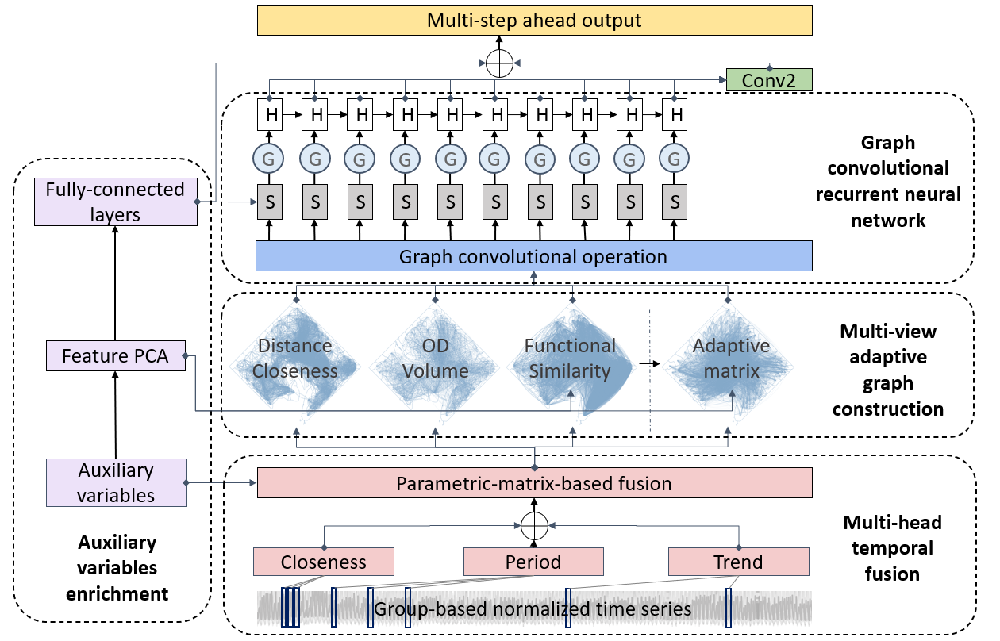

# Multi-ATGCN: A multi-graph multi-head adaptive temporal graph convolutional network for multivariable crowd inflow forecasting



This is a original PyTorch implementation of Multi-ATGCN in the following working paper: \
**Songhua Hu, ... ,Paul Schonfled, 2022, Multi-ATGCN: A multi-graph multi-head adaptive temporal graph convolutional network for multivariable crowd inflow forecasting**

## Environment
We use the torch == 1.10.2 and Python 3.6.11 for implementation.

We follow the framework of [LibCity](https://github.com/LibCity/Bigscity-LibCity) to prepare data and run the model.
See more details in the `requirement.txt` and the [LibCity document](https://bigscity-libcity-docs.readthedocs.io/en/latest/index.html).

Please execute the following command to get the source code.

```bash
git clone https://github.com/SonghuaHu-UMD/MultiSTGraph
cd MultiSTGraph
```

## Data Preparation
The group-based normalized crowd flow data files for Washington, D.C. and Baltimore City, i.e., `201901010601_DC_SG_CTractFIPS_Hourly_Single_GP.7z` and 
`201901010601_BM_SG_CTractFIPS_Hourly_Single_GP.7z`, are available at the `raw_data/` folder. Please extract them to the current fold and 
you will get a set of atomic files following the [LibCity](https://github.com/LibCity/Bigscity-LibCity) Unified Data Structures:

| filename    | content                                                                         | example                                   |
|-------------|---------------------------------------------------------------------------------|-------------------------------------------|
| xxx.geo     | Store geographic entity attribute information.                                  | geo_id, type, coordinates                 |
| xxx.rel     | Store the relationship information between entities, i.e. the adjacency matrix. | rel_id, type, origin_id, destination_id, link_weight |
| xxx.dyna    | Store hourly crowd flow information.                                            | dyna_id, type, time, entity_id, Visits    |
| xxx.ext     | Store external time-varying information, such as weather, holidays, etc.        | ext_id, time, properties[...]             |
| xxx.static  | Store external static information, such as socioeconomics, POIs, demographics.  | geo_id, properties[...]                   |
| config.json | Used to supplement the description of the above table information.              |                                           |

Data are retrieved from [SafeGraph](https://www.safegraph.com/) using the Weekly Places Patterns Dataset. 
If you want to extract dataset in other areas from the raw dataset. Run the following codes at  `./data_prepare`.
The data statistics of two datasets are as followed:

|                           | Washington, D.C.                              | Baltimore City (and surrounding counties) |
|---------------------------|-----------------------------------------------|-------------------------------------------|
| Date Range                | 01/01/2019 - 05/31/2019                       | 01/01/2019 - 05/31/2019                   |
| # Nodes                   | 237                                           | 403                                       |
| # Samples                 | 858,888                                       | 1,460,472                                 |
| Sample Rate               | 1 hour                                        | 1 hour                                    |
| Input length              | 24 hours                                      | 24 hours                                  |
| Output length             | 3 hours, 6 hours, 12 hours, 24 hours          | 3 hours, 6 hours, 12 hours, 24 hours      |                                    |
| Mean of crowd flow        | 30.169                                        | 14.41                                     |
| St.d. of crowd flow       | 84.023                                        | 29.3                                      |

## Code Structure
For easy comparison among different models, the code and data formats follow the framework proposed by [LibCity](https://github.com/LibCity/Bigscity-LibCity):
* The code for Multi-ATGCN is located at `./libcity/model/traffic_flow_prediction/`.
* The code for dataset preprocessing is located at `./libcity/data/dataset/dataset_subclass/mth_dataset.py`.
* The code for other baselines is located at `./libcity/model/`.

You can also directly copy the data and our model to the LibCity environment and run. 
However, I suggest you directly using the repository here since some changes are made compared with the original LibCity:
* A new data format for static variables is added.
* A new dataset class, the mth_dataset, is added, to support multi-head temporal fusion across all models.
* Some changes to support the separate inclusion of time-varying external variables and time-varying calendar variables.
* Configurations of model, data, and executor are changed accordingly to fit our dataset.
* Only those with performance greater than vanilla RNN are selected from LibCity as baselines in our study.

## Model Training
The script `run_model.py` is used for training and evaluating the main model:
```bash
# DC
python run_model.py --task traffic_state_pred --dataset 201901010601_DC_SG_CTractFIPS_Hourly_Single_GP

# Baltimore
python run_model.py --task traffic_state_pred --dataset 201901010601_BM_SG_CTractFIPS_Hourly_Single_GP
```
The script `run_model_baselines.py` is used for training and evaluating other baselines including 
TGCN, DCRNN, AGCRN, ASTGCN, STGCN, MTGNN, GWNET, GMAN, GRU, and LSTM. 
See the reference list here: [Baselines](https://bigscity-libcity-docs.readthedocs.io/en/latest/user_guide/model.html). 

```bash
# DC
python run_model_baselines.py --task traffic_state_pred --dataset 201901010601_DC_SG_CTractFIPS_Hourly_Single_GP
```

The script `run_model_parameters.py` is used for parameter study. Change the parameter you are interested and run:

```bash
# DC
python run_model_parameters.py --task traffic_state_pred --dataset 201901010601_DC_SG_CTractFIPS_Hourly_Single_GP
```

If you are using Google Colab, we also provide a notebook named `Colab_run_model.ipynb` to execute in Colab environment.

**After running the model, you should run the code "result_convert.py" to inversely transform the prediction to recover its scale, since we employ a census tract-based normalization. 
Make sure to clean the `./libcity/cache` fold before run a new round of experiment.**

### Results
#### Model performance in DC area
| Model_name | MAE     | RMSE    | R2     | MAPE   |
|------------|---------|---------|--------|--------|
| MultiATGCN | 11.9197 | 33.9775 | 0.9287 | 0.2714 |
| ASTGCN     | 12.2512 | 33.3753 | 0.9359 | 0.2727 |
| STGCN      | 12.9191 | 37.4189 | 0.9111 | 0.2735 |
| GMAN       | 13.5238 | 38.3246 | 0.9184 | 0.2928 |
| MTGNN      | 13.8971 | 38.0183 | 0.9141 | 0.2966 |
| GWNET      | 13.9606 | 40.9991 | 0.8797 | 0.2838 |
| AGCRN      | 14.5831 | 40.7040 | 0.8950 | 0.3013 |
| GRU        | 15.5306 | 49.6226 | 0.8090 | 0.3063 |
| DCRNN      | 15.9269 | 49.7386 | 0.7937 | 0.3106 |
| TGCN       | 16.8589 | 53.0342 | 0.7410 | 0.3259 |
| LSTM       | 17.7873 | 59.5334 | 0.6509 | 0.3358 |

#### Model performance in Baltimore City
| Model_name | MAE     | RMSE    | R2     | MAPE   |
|------------|---------|---------|--------|--------|
| MultiATGCN | 7.8017  | 15.8327 | 0.8615 | 0.2539 |
| STGCN      | 8.1321  | 16.3235 | 0.8560 | 0.2606 |
| ASTGCN     | 8.5615  | 16.9776 | 0.8436 | 0.2722 |
| MTGNN      | 8.6205  | 17.4740 | 0.8305 | 0.2755 |
| GMAN       | 8.9269  | 18.3447 | 0.8094 | 0.2881 |
| GWNET      | 8.9671  | 17.9015 | 0.8022 | 0.2796 |
| AGCRN      | 9.3033  | 18.8432 | 0.7801 | 0.2851 |
| GRU        | 9.6586  | 19.6673 | 0.7685 | 0.2978 |
| TGCN       | 10.4022 | 20.4641 | 0.7001 | 0.3089 |
| LSTM       | 12.3307 | 24.4955 | 0.5479 | 0.3666 |

#### Multi-view graph learning
 distance closeness, (b) functionality similarity, (c) OD volume, and (d) self-adaptive learning")
Adjacency matrix measured by (a) distance closeness, (b) functionality similarity, (c) OD volume, and (d) self-adaptive learning.

