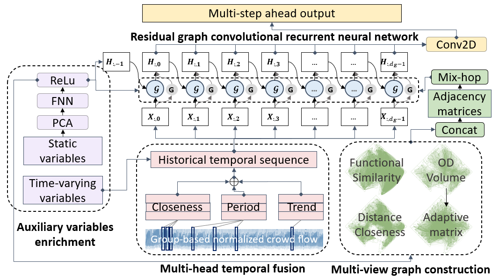

# Multi-ATGCN: A multi-graph multi-head adaptive temporal graph convolutional network for multivariable crowd inflow forecasting



This is a PyTorch implementation of Multi-ATGCN in the following working paper: \
Songhua Hu, ... ,Paul Schonfled, 2022, Multi-ATGCN: A multi-graph multi-head adaptive temporal graph convolutional network for multivariable crowd inflow forecasting

## Environment
We use the torch == 1.10.2 and Python 3.6.11 for implementation.

We follow the framework of [LibCity](https://github.com/LibCity/Bigscity-LibCity) to prepare data and run the model.
See more details in the `requirement.txt` and the [LibCity document](https://bigscity-libcity-docs.readthedocs.io/en/latest/index.html).

Please execute the following command to get the source code.

```bash
git clone https://github.com/SonghuaHu-UMD/MultiSTGraph
cd MultiSTGraph
```

## Data Preparation
The group-based normalized crowd flow data files for Washington, D.C. and Baltimore City, i.e., `201901010601_DC_SG_CTractFIPS_Hourly_Single_GP.7z` and 
`201901010601_BM_SG_CTractFIPS_Hourly_Single_GP.7z`, are available at the `raw_data/` folder. Please extract them to the current fold and 
you will get a set of atomic files following the [LibCity](https://github.com/LibCity/Bigscity-LibCity) Unified Data Structures:

| filename    | content                                                                         | example                                   |
|-------------|---------------------------------------------------------------------------------|-------------------------------------------|
| xxx.geo     | Store geographic entity attribute information.                                  | geo_id, type, coordinates                 |
| xxx.rel     | Store the relationship information between entities, i.e. the adjacency matrix. | rel_id, type, origin_id, destination_id, link_weight |
| xxx.dyna    | Store hourly crowd flow information.                                            | dyna_id, type, time, entity_id, Visits    |
| xxx.ext     | Store external time-varying information, such as weather, holidays, etc.        | ext_id, time, properties[...]             |
| xxx.static  | Store external static information, such as socioeconomics, POIs, demographics.  | geo_id, properties[...]                   |
| config.json | Used to supplement the description of the above table information.              |                                           |

Data are retrieved from [SafeGraph](https://www.safegraph.com/) using the Weekly Places Patterns Dataset. 
If you want to extract dataset in other areas from the raw dataset. Run the following codes at  `./data_prepare`.

## Model Training
The script run_model.py is used for training and evaluating the main model:
```bash
# DC
python run_model.py --task traffic_state_pred --dataset 201901010601_DC_SG_CTractFIPS_Hourly_Single_GP

# Baltimore
python run_model.py --task traffic_state_pred --dataset 201901010601_BM_SG_CTractFIPS_Hourly_Single_GP
```
The script run_model_baselines.py is used for training and evaluating other baselines including 
'TGCN', 'DCRNN', 'AGCRN', 'ASTGCN', 'STGCN', 'MTGNN', 'GWNET', 'GMAN', "GRU", 'LSTM':

```bash
# DC
python run_model_baselines.py --task traffic_state_pred --dataset 201901010601_DC_SG_CTractFIPS_Hourly_Single_GP
```

The script run_model_parameters.py is used for parameter study.

After running the model, you should run the code "result_convert.py" to inversely transform the prediction to recover its scale, since we employ a census tract-based normalization. 
Make sure to clean the `./libcity/cache` fold before run a new round of experiment.

### Results

 distance closeness, (b) functionality similarity, (c) OD volume, and (d) self-adaptive learning")

